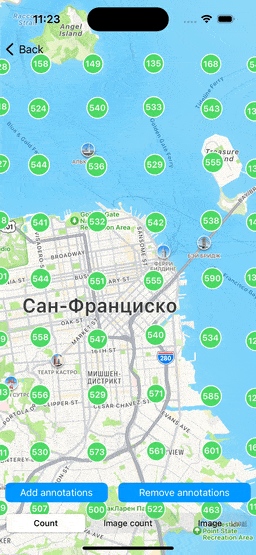
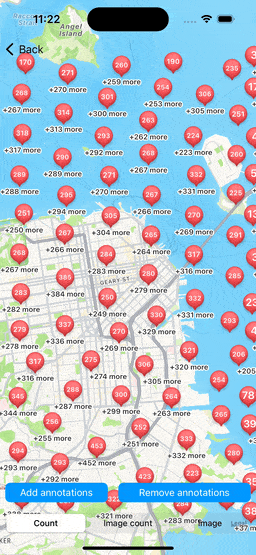

# ClusterMap


ClusterMap is an open-source library for high-performance map clustering. 
When you want to present many points over the map for better user experience and performance, you can make clusters from many points. A good starting point is using a native clustering mechanism. It's simple to implement, simple to use, and has nice animations with zero lines of code. The core problem of the native implementation is adding all points to the map in MainThread. You can't avoid this bottleneck, and it's a problem if you want to operate with thousand points. 
ClusterMap uses efficient QuadTree storage and performs all computations in the background thread. 

Comparison with 20,000 annotations. For a detailed comparison, use [Example-UIKit](Example).

 

- [Features](#features)
- [Demo](#demo)
- [Installation](#installation)
- [Usage](#usage)
- [Documentation](#documentation)
- [Credits](#credits)
- [License](#license)

## Features

- [x] UIKit
- [ ] SwiftUI
- [ ] Swift concurrency
- [x] Adding/Removing Annotations
- [x] Clustering Annotations
- [x] Multiple Managers
- [x] Dynamic Cluster Disabling
- [x] Custom Cell Size
- [x] Custom Annotation Views

## Demo

The [Example](Example) is a great place to start. It demonstrates how to:

- Integrate the library
- Add/remove annotations
- Reload annotations
- Configure the annotation view
- Configure the manager
- Compare Apple's native implementation with to library

## Installation

ClusterMap is available via Swift Package Manager.

### Swift Package Manager

Add the following dependency to your **Package.swift** file:

```swift
.package(url: "https://github.com/vospennikov/ClusterMap.git", from: "1.1.0")
```

### Cocoapods

ClusterMap is available through CocoaPods. To install it, add the following line to your Podfile:

```ruby
pod 'ClusterMap', '1.1.0'
```


## Usage

### The Basics
The `ClusterManager` class generates, manages, and displays annotation clusters.

```swift
let clusterManager = ClusterManager()
```

### Adding an Annotation

Create an object that conforms to the `MKAnnotation` protocol. Next, add the annotation object to an instance of `ClusterManager` with `add(annotation:)`.

```swift
let annotation = MKPointAnnotation()
annotation.coordinate = CLLocationCoordinate2D(latitude: 21.283921, longitude: -157.831661)
manager.add(annotation)
```

### Configuring the Annotation View

Implement the map view's `mapView(_:viewFor:)` delegate method to configure the annotation view. Return an instance of `MKAnnotationView` to visually represent the annotations.

To display clusters, return an instance of `ClusterAnnotationView`.

```swift
extension ViewController: MKMapViewDelegate {
    func mapView(_ mapView: MKMapView, viewFor annotation: MKAnnotation) -> MKAnnotationView? {
        if let annotation = annotation as? ClusterAnnotation {
            return CountClusterAnnotationView(annotation: annotation, reuseIdentifier: "cluster")
        } else {
            return MKPinAnnotationView(annotation: annotation, reuseIdentifier: "pin")
        }
    }
}
```

For performance reasons, you should generally reuse `MKAnnotationView` objects in your map views. See the [Example](Example) to learn more.

#### Customizing the Appearance

The `ClusterAnnotationView` class exposes a `countLabel` property. You can subclass `ClusterAnnotationView` to provide custom behavior as needed. Here's an example of subclassing the `ClusterAnnotationView` and customizing the layer `borderColor`.

```swift
class CountClusterAnnotationView: ClusterAnnotationView {
    override func configure(_ annotation: ClusterAnnotation) {
        super.configure(annotation)
        layer.borderColor = UIColor.white.cgColor
        layer.borderWidth = 1.5
    }
}
```

See the [AnnotationView](Example/Shared/Views/CountClusterAnnotationView.swift) to learn more.

### Removing Annotations

To remove annotations, you can call `remove(annotation:)`. However, the annotations will still display until you call `reload()`.

```swift
manager.remove(annotation)
```

If `shouldRemoveInvisibleAnnotations` is set to `false`, annotations that have been removed may still appear on the map until calling `reload()` on the visible region.

### Reloading Annotations

Implement the map view's `mapView(_:regionDidChangeAnimated:)` delegate method to reload the `ClusterManager` when the region changes.

```swift
func mapView(_ mapView: MKMapView, regionDidChangeAnimated animated: Bool) {
    clusterManager.reload(mapView: mapView) { finished in
        // handle completion
    }
}
```

You should call `reload()` anytime you add or remove annotations.

### Configuring the Manager

The `ClusterManager` class exposes several properties to configure clustering:

```swift
var zoomLevel: Double // The current zoom level of the visible map region.
var maxZoomLevel: Double // The maximum zoom level before disabling clustering.
var minCountForClustering: Int // The minimum number of annotations for a cluster. The default is `2`.
var shouldRemoveInvisibleAnnotations: Bool // Whether to remove invisible annotations. The default is `true`.
var shouldDistributeAnnotationsOnSameCoordinate: Bool // Whether to arrange annotations in a circle if they have the same coordinate. The default is `true`.
var distanceFromContestedLocation: Double // The distance in meters from contested location when the annotations have the same coordinate. The default is `3`.
var clusterPosition: ClusterAlignment // The position of the cluster annotation. The default is `.nearCenter`.
```

### ClusterManagerDelegate

The `ClusterManagerDelegate` protocol provides many functions to manage clustering and configure cells.

```swift
// The size of each cell on the grid at a given zoom level.
func cellSize(for zoomLevel: Double) -> Double? { ... }

// Whether to cluster the given annotation.
func shouldClusterAnnotation(_ annotation: MKAnnotation) -> Bool { ... }
```

## Documentation

The documentation for releases and `main` are available here:

* [`main`](https://vospennikov.github.io/ClusterMap/main/documentation/clustermap)
* [1.1.0](https://vospennikov.github.io/ClusterMap/1.1.0/documentation/clustermap)
* [1.0.0](https://vospennikov.github.io/ClusterMap/1.0.0/documentation/clustermap)

## Credits and thanks

This project is based on the work of [Lasha Efremidze](https://github.com/efremidze), who created the [Cluster](https://github.com/efremidze/Cluster).

## License

This library is released under the MIT license. See [LICENSE](LICENSE) for details.
